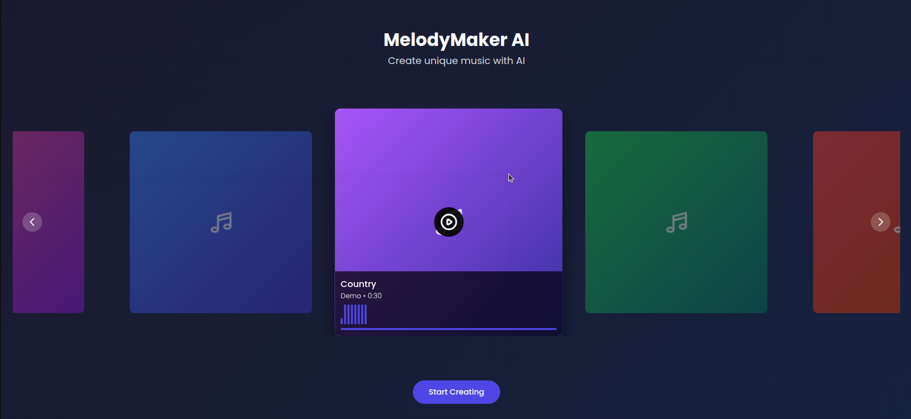

# Music Genre Generation System: MelodyMaker AI

## 🎵 Project Overview

**MelodyMaker AI** is an AI-powered web application designed to generate and recommend music tracks in specific genres. The system aims to streamline music creation and enhance recommendation engines by leveraging machine learning for genre classification and music generation.

> **Objective:** Modern music streaming services rely on efficient content creation and recommendation. This project seeks to develop a machine learning system that can **automatically generate music in user-selected genres**. By analyzing audio features, the system will ensure generated tracks fit genres such as classical, rock, pop, and more.



---

## Table of Contents

- [Dataset](#dataset)
- [Features](#features)
- [Live Demo](#live-demo)
- [Installation & Usage](#installation--usage)
  - [Clone the Repository](#clone-the-repository)
  - [Prepare the Dataset](#prepare-the-dataset)
  - [Install Dependencies](#install-dependencies)
  - [Run the Application](#run-the-application)
- [Project Structure](#project-structure)
- [How It Works](#how-it-works)
- [Music Generation Model (Updating...)](#music-generation-model)
- [References](#references)
- [Contributors](#contributors)
- [Notes](#notes)

---

## 📁 Dataset

- **GTZAN Genre Collection**
  - 1,000 music clips (each 30 seconds)
  - 10 genres: `blues`, `classical`, `country`, `disco`, `hiphop`, `jazz`, `metal`, `pop`, `reggae`, `rock`
  - Used for both training and demo purposes

---

## 🚀 Features

- **Interactive Web Interface:**  
  Modern, responsive UI for music selection, customization, and playback.

- **Genre-based Music Generation:**  
  (Coming soon) Generate new music tracks in the selected genre using AI.

- **Audio Player & Visualizer:**  
  Listen to generated or demo tracks with real-time visual feedback.

- **Download Options:**  
  Download generated music in multiple formats (MP3, WAV, MIDI).

---

## 🖥️ Live Demo

**Demo Video** [link](https://drive.google.com/file/d/1D_03y6fVvbKH3iRNa-dWK6zmQOpz_92D/view?usp=share_link)

---

## 🛠️ Installation & Usage

### 1. **Clone the Repository**

```bash
git clone https://github.com/sontypo/MelodyMaker_AI_App.git
cd MelodyMaker_AI_App
```

### 2. **Prepare the Dataset**

- Ensure the `genres` folder exists in the project root, containing subfolders for each genre with `.au` files (from the GTZAN dataset).

### 3. **Install Dependencies**

#### **All Platforms**

```bash
pip install -r requirements.txt
```

### 4. **Run the Application**

#### **Linux / macOS**

```sh
chmod +x run.sh
./run.sh
```

#### **Windows**

Double-click `run.bat` or run in Command Prompt:

```bat
run.bat
```

- The browser will open automatically at [http://localhost:8090/index.html](http://localhost:8090/index.html).

---

## 🏗️ Project Structure

```
MelodyMaker_AI_App/
│
├── app.py                # Flask backend (API for music generation)
├── requirements.txt      # Python dependencies
├── run.sh                # Startup script for Linux/macOS
├── run.bat               # Startup script for Windows
│
├── index.html            # Main frontend page
├── script.js             # Frontend logic
├── styles.css            # Custom styles
│
└── genres/               # GTZAN dataset (audio files)
    ├── blues/
    ├── classical/
    └── ...
```

---

## ⚙️ How It Works

1. **Frontend:**  
   - Users select **genre**, **instruments**, **tempo**, and **length** for the music to be generated.
   - Users can now also select the **Generation Mode** (Original Dataset, RAVE Model, or Existing API Model) via radio buttons on the customization screen.
   - All selected options are sent to the backend via a POST request when the user clicks "**Generate Music**".

2. **Backend:**  
   - Receives all parameters, including `generate_mode`, from the frontend.
   - Depending on the selected `generate_mode`:
     - **Mode 0:** Returns a random demo track from the original dataset.
     - **Mode 1:** Generates music using the RAVE model and returns the result.
     - **Mode 2:** Generates music using the API model and returns the result.
   - The backend streams the generated or selected audio file back to the frontend.

3. **Playback & Download:**  
   - The frontend displays a player for the generated track.
   - Users can listen to the generated music and download it in multiple formats (MP3, WAV, MIDI).
   - The UI provides real-time progress, visual feedback, and download options.

---

## 🧠 Music Generation Model (Updating...)

> **This section will be updated as the model is developed.**

- The backend will integrate a machine learning model to generate music in the selected genre.
- The model will analyze audio features and synthesize new tracks.
- More details and technical documentation will be added here.

Our system currently supports **hybrid music generation**. Users can select from available techniques to generate genre-specific audio based on their needs or preferences.

### 1. RAVE (Real-time Audio Variational autoEncoder)

**RAVE** is a neural audio synthesizer capable of generating raw audio directly from latent noise vectors. We trained a custom RAVE model on the **GTZAN dataset** to capture genre-specific audio characteristics.

#### 🛠️ RAVE Pipeline:

- Conversion of `.au` files to `.wav` format  
- Preprocessing, training, and export using RAVE tools  
- Latent noise sampling to synthesize new music clips  

> For complete training scripts and configuration, see the [`train_rave/`](./train_rave/) folder in this repository.

#### ⚠️ Challenges:

- **Presence of noise** in outputs, especially during early training phases  
- **Long training times** required for each genre  
- Performs **better in genres without vocals**, such as *classical*  
- Due to time constraints, RAVE has only been trained on:
  - `classical`
  - `blues`
  - `country`
  - `pop`
  - `reggae`

>  Note: The RAVE option may not always yield optimal results across all genres. Therefore, we provide an alternative generation method for improved quality.

### 2. Denoising Diffusion Implicit Model (DDIM)

**Diffusion-based generative models** are a recent and powerful approach for raw audio synthesis. Our implementation leverages a U-Net architecture with self-attention and sinusoidal embeddings, trained to denoise [Modified Discrete Cosine Transform (MDCT)](https://www.tensorflow.org/api_docs/python/tf/signal/mdct) representations of audio.

#### 🛠️ DDIM Pipeline:

- **Preprocessing:**  
  - Convert `.au` files to MDCT spectrograms (using DCT-IV).
  - Normalize and segment audio for training.
- **Model Architecture:**  
  - U-Net with residual blocks and self-attention layers.
  - Sinusoidal embeddings for diffusion time conditioning.
- **Training:**  
  - Trained to reverse a forward diffusion process (adding noise to audio).
  - Losses include MSE, spectral norm, and time-derivative loss.
- **Generation:**  
  - Start from random noise and iteratively denoise using the trained model.
  - Inverse MDCT to reconstruct audio waveform.
- **Export:**  
  - Generated samples are saved as `.wav` files for each genre.

> For full code and training details, see [`diffusion_model/ddim_pytorch.ipynb`](./diffusion_model/ddim_pytorch.ipynb).

#### ⚠️ Challenges:

- **High computational requirements** for training and generation.
- **Audio quality** is highly dependent on training duration and model tuning.
- **Genre diversity:** Model performance may vary across genres.
- Due to time constraints and limitation of the hardware performance, DDIM has only been trained on:
  - `blues`
  - `classical`

>  Note: The decision to use DDIM could potentially bring significant improments to the project's objective. However, it requires a long training time and high computational capacity The **results** included in [`diffusion_model/generated`](./diffusion_model/generated) did not meet expectations due to the work of reduced training time and limited computaional resources. Nevertheless, it remains a promising model.

### 3. MEL-GAN (Mel-Spectrogram Generative Adversarial Network)

**MEL-GAN** is a GAN-based model designed to generate mel-spectrograms conditioned on genre labels, which are then converted back to audio waveforms. This approach leverages adversarial training to produce more realistic and high-fidelity audio samples.

#### 🛠️ MEL-GAN Pipeline:

- **Preprocessing:**  
  - Convert `.au` files to mel-spectrograms and save as `.npy` files for each genre.
- **Model Architecture:**  
  - **Generator:** Takes random noise and genre label as input, outputs a mel-spectrogram.
  - **Discriminator:** Evaluates the authenticity of generated mel-spectrograms, conditioned on genre.
- **Training:**  
  - Adversarial training between Generator and Discriminator.
  - Losses are tracked and visualized for both networks.
- **Generation:**  
  - Sample random noise and a genre label to generate a mel-spectrogram.
  - Use `librosa.feature.inverse.mel_to_audio` to reconstruct the waveform from the generated mel-spectrogram.
- **Export:**  
  - Generated audio is saved as `.wav` files.

> For full code and training details, see [`melgan_model/MEL-GAN.ipynb`](./melgan_model/MEL-GAN.ipynb).

#### ⚠️ Challenges:

- **GAN training instability:** Training GANs for audio can be unstable and may require careful tuning.
- **Mel-to-audio inversion:** The quality of reconstructed audio depends on the effectiveness of the inversion process.
- **Genre conditioning:** Ensuring the generator produces genre-consistent outputs is an ongoing challenge.

---

## 📚 References

- [GTZAN Genre Collection Dataset](http://marsyas.info/downloads/datasets.html)
- [Flask Documentation](https://flask.palletsprojects.com/)
- [Tailwind CSS](https://tailwindcss.com/)
- [acids-ircam RAVE](https://github.com/acids-ircam/RAVE)
- [Modified Discrete Cosine Transform (MDCT)](https://www.tensorflow.org/api_docs/python/tf/signal/mdct)
- [Denoising Diffusion Implicit Models](https://keras.io/examples/generative/ddim/)

---

## 👥 Contributors
This project was developed and carried out by a group of four students as the final project for the course 'Machine Learning in Engineering Science', under the guidance of Professor [Chi-Hua Yu](https://researchoutput.ncku.edu.tw/en/persons/chi-hua-yu).

- Hong-Son Nguyen (阮洪山) [✉](mailto:n16137037@gs.ncku.edu.tw)
- Yu-Chen Ko (柯妤蓁) [✉](mailto:e14094154@gs.ncku.edu.tw)
- Yong-Jhih Yang (楊詠智) [✉](mailto:n16134623@gs.ncku.edu.tw)
- Chia-Cheng Hsu (徐嘉呈) [✉](mailto:n48131504@gs.ncku.edu.tw)

---

## 📢 Notes

- This project is under active development.
- For questions or contributions, please open an issue or pull request.

---
